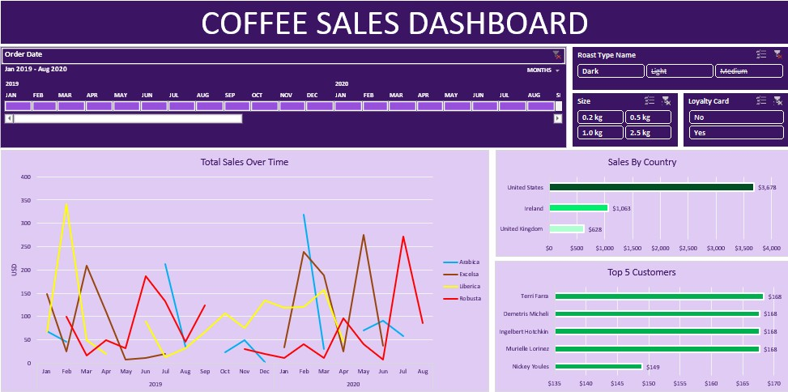

# Coffee Sales Dashboard | Excel Data Analytics Project

## Overview

This project is an interactive Coffee Sales Dashboard built in Microsoft Excel to analyze sales performance, customer trends, and product insights.

The dashboard transforms raw order data into meaningful business insights using Excel analytics and visualization tools.

---

## Dashboard Preview

<!-- Add your dashboard screenshot below -->

---

## Project Features

- Interactive Excel Dashboard
- Sales Trend Analysis
- Top 5 Customers Analysis
- Country-wise Sales Comparison
- Coffee Product Performance Tracking
- Dynamic Charts & Filters
- KPI Reporting

---

## Tools & Skills Used

- Microsoft Excel
- Pivot Tables
- Pivot Charts
- Slicers & Filters
- Data Cleaning
- Data Visualization
- KPI Analysis
- Dashboard Design

---

## Dataset

The dataset includes:
- Orders data
- Customer information
- Product details
- Sales records

---

## Key Insights

- Identified highest-performing coffee products
- Analyzed customer purchasing behavior
- Compared sales performance across countries
- Tracked overall revenue trends

---

## Files Included

- `coffeeOrdersProject.xlsx` — Main Excel dashboard project
- Dashboard screenshots
- README documentation

---

## Credits

This project was recreated and adapted for portfolio purposes based on the original Excel project/tutorial by Mo Chen.

Full credit goes to the original creator for the project idea and learning resources.

---

## Author

**Amber Asad**  
